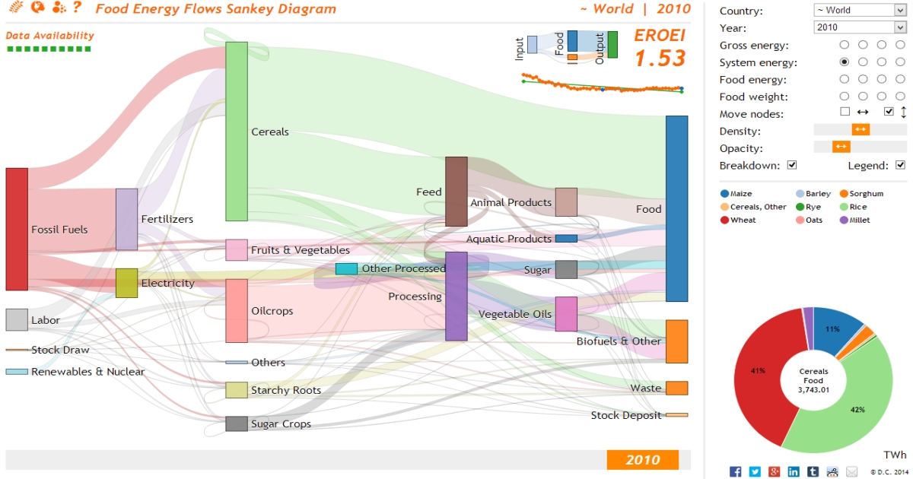

[  Food Energy Flows Exploratorium](http://food.csaladen.es/)
===

  
Investigating the role of food in the global sustainable energy transition and highlighting how society needs to be aware of EROEI (energy return on energy invested) dynamics of the different food sources as it transitions away from fossil fuels and changes its diet.  A project by [Dénes Csala](http://www.csaladen.es/) [Sgouris Sgouridis](http://www.ssgouridis.org/) at [Lancaster University](http://lancaster.ac.uk) and [Masdar Institute of Science and Technology](http://www.masdar.ac.ae/)

# App
Try: http://food.csaladen.es

# Articles
1. [Food and Energy in the Global Sustainable Energy Transition: An Energy Metabolism View of Global Agriculture Systems](http://www.csaladen.es/doc/Denes_Csala_SYDIC_2015.pptx), in preparation

# Models
Food Energy Flows Exploratorium | [Interactive website](http://food.csaladen.es/) | [source file](http://food.csaladen.es/js/food.js)
Food Energy Flows Sankey Diagram | [Interactive visualization](http://food.csaladen.es/) | [source file](http://food.csaladen.es/js/sankey.js)
Food Energy Flows World Map | [Interactive visualization](http://food.csaladen.es/#&map) | [source file](http://food.csaladen.es/map/index.html)
Food Energy Flows Data Plots | [Interactive visualization](http://food.csaladen.es/#&scatter) | [source file](http://food.csaladen.es/js/scatter.js)
Food Energy Flows Data Parser | [IPython notebook](http://nbviewer.ipython.org/url/food.csaladen.es/ipython/S1.ipynb) | [source file](http://food.csaladen.es/ipython/S1.ipynb)
Food Energy Flows Data Plotter | [IPython notebook](http://nbviewer.ipython.org/url/food.csaladen.es/ipython/S2.ipynb) | [source file](http://food.csaladen.es/ipython/S2.ipynb)

# Cite
As of July 2015, please contact the authors (Dénes, Sgouris) before this citing or using this work in any form - or if you would like to use the data presented on this website more extensively or you would like to collaborate on the project.

# Description
You can find a detailed description of the model creation, data mining and analysis and visualization [here](http://food.csaladen.es/#&description), in the __Data__ section. The code is presented in interactive Jupyter notebooks that you can download and run yourself.

# Credit
Dénes Csala, 2017  
http://csaladen.es
